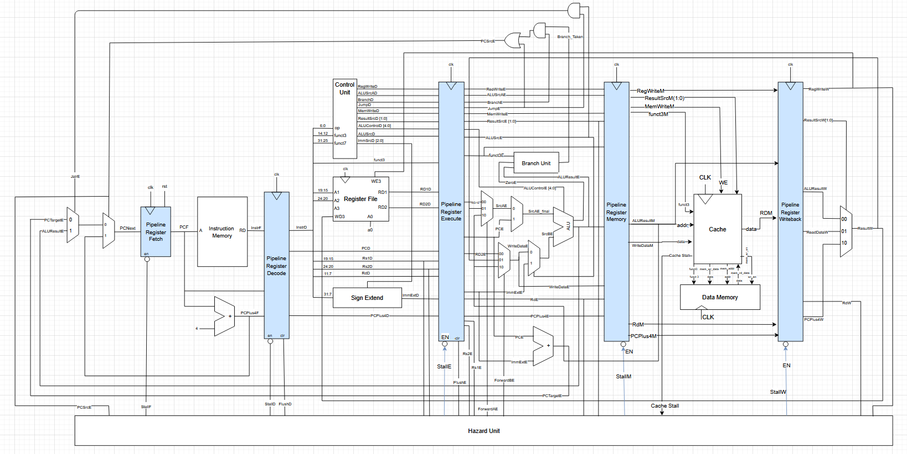
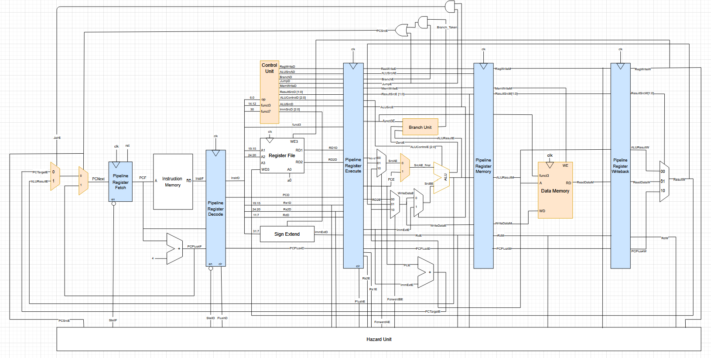

# Team Statement: RISC-V RV32I Pipelined Processor with Cache

## Table Of Contents

- [Quick Start](#quick-start)

- [Team Members and Contributions](#team-members-and-contributions)

- [Single Cycle Foundation](#single-cycle-foundation)

- [Pipelined Processor Design](#pipelined-processor-design)

- [Cache Implementation](#cache-implementation)

- [Testing and Verification](#testing-and-verification)

## Quick Start

Our team successfully implemented a fully functional RISC-V RV32I pipelined processor with integrated two-way set-associative cache memory, achieving all stretch goals outlined in the project specification. The processor supports the complete RV32I instruction set including arithmetic, logical, memory, branch, and jump operations, with hazard detection and forwarding logic to maintain correct execution across the pipeline stages.



To run all tests:
  
```bash

cd ./tb

./doit.sh

```

For individual component testing:

```bash

cd ./tb/tests/component_tests

chmod +x runtests.sh

./runtests.sh

```

## Team Members and Contributions


| Team Member       | GitHub        | CID      | Email           | Personal Statement |
| ----------------- | ------------- | -------- | --------------- | ------------------ |
<<<<<<< HEAD
| Joshua Hirschkorn | vortexisalpha | 02378306 | jh1234@ic.ac.uk |         [Joshua's Personal Statement](./repo/personal_statements/Joshua_Hirschkorn_Statement.md)           |
| Yichan Kim           | YichanKim  | 02327531 | yk1122@ic.ac.uk |         [Yichan's Personal Statement](./repo/personal_statements/Yichan_Kim_Statement.md)           |
| Anthony Bartlett          |  an-thony350             |  02556059        |    ab4324@ic.ac.uk     |     [Anthony's Personal Statement](./repo/personal_statements/Anthony_Bartlett_Statement.md)  |
| Carys Leung            | zenbean       | 02565398 | ccl224@ic.ac.uk |  [Carys' Personal Statement](./repo/personal_statements/Carys_Leung_Statement.md)        |
=======
| Joshua Hirschkorn | vortexisalpha | 02378306 | jh1234@ic.ac.uk | [Joshua's Statment](./repo/personal_statements/Joshua_Hirschkorn_Statement.md)|
| Yichan            | an-thony350   | 02556059 | ab4324@ic.ac.uk |[Yichan's Statment](./repo/personal_statements/Yichan_Kim_Statement.md)|
| Anthony           |  an-thony350|  02556059        |     ab4324@ic.ac.uk            |                    |
| Carys             | zenbean       | 02565398 | ccl224@ic.ac.uk |                    |
>>>>>>> 60b466a (changes to readme and josh ps)

### High-Level Contribution Summary

| **Component**                   | **Joshua** | **Yichan** | **Carys** | **Anthony** |
| ------------------------------- | ---------- | ---------- | --------- | ----------- |
| Single Cycle Foundation (Lab 4) | X          | X          | X         | X           |
| Pipelined Design                | X          | X          |           |             |
| Cache Implementation            | X          | X          |           |             |
| Control Unit & ALU Expansion    |            |            | X         | X           |
| Testing Framework               | X          | X          |           |             |
| Top-Level Integration           | X          | X          |           |             |
| Multiplication Instructons      |            |            |           | X           |
| Branch Prediction               |            |            | X         |             |

## Single Cycle Foundation

The project builds upon our Lab 4 implementation where we constructed a reduced RISC-V single cycle processor capable of executing basic instructions. 

Yichan was primarily responsible for the initial ALU implementation and register file design, which established the computational foundation that would later be expanded for the full instruction set. He also created and linked all the components in the `top.sv` file, ensuring that all the spacing and naming conventions were coherent to provide the least friction for future addition of modules.

Joshua worked on testing all components in the CPU. This included debugging other peoples modules and writing comprehensive test cases in C++. Individual component test benches were created for: ALU, Control Unit, Muxes, Sign extension unit and Instruction memory.

Anthony worked on the F1 lights implementation, and testing instructions + debugging

Carys designed the instruction memory, control unit, and sign extension components. Initially, the instruction memory was word-addressed, but in collaboration with Yichan, it was developed into a byte-addressed system to ensure precise instruction fetching. Additionally, a future-proof control unit was designed, allowing for easy scalability when expanding the design in later stages.

A more detailed readme of the single_cycle can be found here:
[View single cycle branch](https://github.com/IAC-Group-2/Project_Brief/tree/single_cycle)

## Pipelined Processor Design

[See pipelined tag release](https://github.com/IAC-Group-2/Project_Brief/tree/Pipeline)

The transition from single cycle to pipelined architecture represented a substantial engineering challenge for the project, requiring careful coordination between team members to ensure all signals propagated correctly through the five pipeline stages: Fetch, Decode, Execute, Memory, and Writeback.


[See full image here](https://ibb.co/7tk689jL)

### Pipeline Architecture Overview

Our implementation divides instruction execution across five stages separated by pipeline registers that latch all necessary signals on each clock edge. This organisation permits up to five instructions to execute simultaneously within different stages, theoretically improving throughput by a factor of five compared to the single cycle design, though hazards and stalls reduce this advantage in practice.

The pipeline registers follow a consistent naming convention where signals include stage suffixes (F, D, E, M, W) to indicate their current position within the pipeline, making signal tracing during debugging significantly more manageable and reducing integration errors during top-level module assembly.

### Pipeline Registers

Joshua implemented `pip_reg_m` (Execute to Memory) and `pip_reg_e` (Decode to Execute), while Yichan created `pip_reg_d` (Fetch to Decode), `pip_reg_w` (Memory to Writeback), and modified the `pc_reg` module to support stalling functionality through an enable signal.

The Decode to Execute register (`pip_reg_e`) is the most complex, carrying fifteen distinct signals including control signals, register addresses, immediate values, and the program counter, all requiring flush capability to handle control hazards. This is why Joshua was working on 2 pipeline registers and Yichan was working on 3:

Example:

```systemverilog

always_ff @(posedge clk_i) begin

if (clr_i) begin // Flush logic for control hazards

RegWriteE_o <= 'b0;

ResultSrcE_o <= 'b0;

MemWriteE_o <= 'b0;

JumpE_o <= 'b0;

BranchE_o <= 'b0;

ALUControlE_o <= 'b0;

// ... all signals cleared to insert NOP

end

else if (en_i) begin

RegWriteE_o <= RegWriteD_i;

ResultSrcE_o <= ResultSrcD_i;

// ... normal propagation

end

end

```


The flush mechanism (`clr_i`) clears all outputs to zero, effectively inserting a NOP instruction into the pipeline, which becomes essential when branch mispredictions require discarding speculatively fetched instructions that should not execute.

### Hazard Detection and Forwarding

Joshua and Yichan collaboratively designed and implemented the hazard unit during extended video call sessions, carefully deriving the logic required to detect data dependencies and generate appropriate forwarding or stalling signals. The hazard unit monitors register addresses across pipeline stages and determines when forwarding can resolve dependencies without stalling.

Data forwarding resolves most Read After Write (RAW) hazards by routing computed values directly from later pipeline stages back to the execute stage inputs, bypassing the register file entirely:


```systemverilog

// Forward from Memory stage takes priority (more recent data)

if (((Rs1E_i == RdM_i) && RegWriteM_i) && (Rs1E_i != '0)) begin

ForwardAE_o = 2'b10; // Memory stage forwarding

end

else if (((Rs1E_i == RdW_i) && RegWriteW_i) && (Rs1E_i != '0)) begin

ForwardAE_o = 2'b01; // Writeback stage forwarding

end

```
  

The check ensuring source registers differ from x0 prevents unnecessary forwarding operations and maintains correct behaviour since x0 should always read as zero regardless of any forwarding paths.

Load instructions create a special hazard scenario where the data being loaded is not available until after the memory stage completes, meaning no forwarding path can resolve the dependency within a single cycle. The hazard unit detects this condition and stalls the pipeline:

```systemverilog

lwStall = ResultSrcE0_i && ((Rs1D_i == RdE_i) || (Rs2D_i == RdE_i));

StallF_o = lwStall || CacheStall_i;

StallD_o = lwStall || CacheStall_i;

FlushE_o = (lwStall || PCSrcE_i); // Insert bubble in execute stage

```

### Branch Unit

The branch unit, implemented by Carys and Anthony, evaluates branch conditions in the execute stage using the ALU `zero` flag and result values. It determines whether a conditional branches should be taken based on the `funct3` field encoding:

```systemverilog
always_comb begin
    unique case(funct3_i)
        3'b000: BranchTaken_o = Zero_i; // BEQ
        3'b001: BranchTaken_o = !Zero_i; // BNE
        3'b100: BranchTaken_o = ($signed(SrcA_i) < $signed(SrcB_i)); // BLT
        3'b101: BranchTaken_o = ($signed(SrcA_i) >= $signed(SrcB_i)); // BGE
        3'b110: BranchTaken_o = (SrcA_i < SrcB_i); // BLTU
        3'b111: BranchTaken_o = (SrcA_i >= SrcB_i); // BGEU
        default: BranchTaken_o = 1'b0;
    endcase
end
```

When transitioning from single-cycle to a 5 stage pipeline processor, we introduced a dedicated branch unit. In a single cycle design, the branch logic was embedded into the control unit or relied on the ALU's `zero` flag. For the pipeline design, we needed a more robust and independent component to resolve control flow decisions explicitly.

The branch unit component is placed in the execute stage. This implementation ensures that the register operands (read during the decode stage) are available for comparison. More importantly, this allows us to use the existing forwarding logic. Since the branch unit is in the same stage as the ALU, the forwarding logic can supply the most recent data to both components simultaneously, resolving data hazards on branch operands. 

If branch is taken, the instructions that are in decode and fetch stages will be incorrect. To resolve this, the hazard unit must flush both stages which results in a 2 cycle branch misprediction penalty. Simultaneously the PC multiplexer routes the computed branch target address back to the fetch stage to restart execution at the correct location.


### Control Unit

The control unit, significantly expanded by Carys and Anthony to support the complete RISC-V32I instruction set, decodes the `opcode`, `funct3`, and `funct7` fields to generate all control signals required by the datapath. The main decoder uses a case statement to identify instruction types:

```systemverilog
case (op_i)
    7'b0110011: begin // R-Type
        RegWrite_o = 1;
        ALUOp      = 2'b10;
    end
    7'b0010011: begin // I-Type Arithmetic
        RegWrite_o = 1;
        ALUSrc_o   = 1;
        ALUOp      = 2'b10;
        // ... (additional logic)
    end
    // ... additional instruction types
endcase
```

A secondary decoder translates the `ALUOp` signal and `funct3`/`funct7` fields into the specific 4 bit ALU control signal. This handles the distinction between operations like ADD and SUB (which share the same `funct3` but differ in `funct7`) and manages the various I-Type immediate arithmetic operations.

Adapting the control unit to accommodate the 5 stage pipeline required decoupling the decision making processes. In a single cycle processor, all control signals are generated and executed in a single clock cycle. Whereas in a pipelined design, signals generated in the decode stage must propagate through pipeline registers to be used in later stages (execute, memory, and writeback). By decoupling these decisions, the control unit avoids stalling for the ALU; instead, it flags the instruction and allows the pipeline logic to resolve the action once the necessary data becomes available.

In a pipelined architecture, the control unit in the decode stage cannot know the outcome of a branch comparison, as that evaluation happens in the execute stage. To resolve this, we separated the logic. The decoder flags a branch instruction, and a separate logic block determines the final `PCSrc_o` (next PC Source) by combining this branch signal with the `Zero_i` flag which is fed back from the execute stage.

Implementing `JALR` in a pipeline was challenging because its target address is calculated by the ALU (register + immediate), unlike `JAL` or branch instructions which use the PC adder. To resolve this, we introduced a `jalr` flag in the control unit. When high, this flag forces the PC multiplexer to ignore the PC adder and instead select the `ALUResult` as the next PC address, ensuring that the jump target is correctly sourced from the Execute stage.

To support `LUI` within the pipeline without adding another stage or component, we modified the ALU control logic by assigning it a specific ALU opcode (2'b11). This allows us to use the existing execute stage datapath, the immediate value generated in the decode stage is passed to the ALU, which simply passes it through (SrcB) to be written back, removing the need for specialized hardware.

Finally, we ensured that control signals remain valid throughout execution by propagating the control unit's outputs into the pipeline registers. This allows critical signals such as 'Write Enable' to travel with the instruction and trigger the correct action cycles later.

## Cache Implementation

The cache implementation represented a significant extension beyond the core project requirements, with Joshua and Yichan collaborating extensively through video calls to design and implement a two way set associative writeback cache that integrates seamlessly with the pipelined processor.

<<<<<<< HEAD

=======
.drawio.png)
>>>>>>> 60b466a (changes to readme and josh ps)

### Cache Architecture

The cache stores 2 kilobytes of data across 256 sets, with each set containing two ways (cache lines). Each way stores a 32-bit data word alongside valid, dirty, and tag bits, with an LRU (Least Recently Used) bit per set indicating which way to replace on a cache miss:


```

Cache Line Format:

LRU (1)
Way0: Valid(1) Dirty(1) Tag(22) Data(32)
Way1: Valid(1) Dirty(1) Tag(22) Data(32)

```

The 22-bit tag, 8-bit set index, and 2-bit byte offset partition the 32-bit address, allowing the cache to hold data from across the entire address space while using the set index for direct mapping within each way.

### State Machine Design

Cache misses trigger a finite state machine that transitions through up to four states depending on whether the evicted cache line requires writeback.


The logic for this is below:  

```systemverilog

typedef enum {IDLE, WRITEBACK, FETCH, UPDATE} my_state;

  

always_comb begin

case (current_state)

IDLE: begin

if (cache_miss) begin

if (target_dirty)

next_state = WRITEBACK; // Evict dirty data first

else

next_state = FETCH; // Skip directly to fetch

end

end

WRITEBACK: next_state = FETCH;

FETCH: next_state = UPDATE;

UPDATE: next_state = IDLE;

endcase

end

```

The WRITEBACK state writes the dirty cache line back to main memory before fetching the new data, ensuring coherency between cache and memory. The UPDATE state stores the fetched data into the cache and updates the appropriate metadata bits before returning to IDLE.

### Cache Stall Integration

Joshua and Yichan modified the hazard unit to handle cache miss stalling, freezing all pipeline stages while the cache completes its state machine sequence. Unlike load-word stalls which only affect the front of the pipeline, cache stalls must freeze all stages to prevent any instruction from advancing with potentially stale or inconsistent data:

```systemverilog

StallF_o = lwStall || CacheStall_i;

StallD_o = lwStall || CacheStall_i;

StallE_o = CacheStall_i; // Later stages only stall on cache miss

StallM_o = CacheStall_i;

StallW_o = CacheStall_i;

  

if (!CacheStall_i) begin // Prevent flush during cache stalls

FlushD_o = PCSrcE_i;

FlushE_o = (lwStall || PCSrcE_i);

end

```

The critical insight here is that flush operations must be disabled during cache stalls because the instructions in the pipeline remain valid and should not be discarded; they are simply waiting for memory data to become available.

### Byte Addressing Support

A significant debugging challenge arose when byte-addressed memory operations (LBU, SB) failed because the cache initially operated only on word-aligned addresses. Joshua and Yichan implemented byte offset logic that extracts the appropriate byte from cached words during reads and merges individual bytes into existing words during writes:


```systemverilog

// Extract correct byte based on offset for read operations

if (byte_offset == 2'b00)

data_o = {24'b0, raw_cache_data[7:0]};

else if (byte_offset == 2'b01)

data_o = {24'b0, raw_cache_data[15:8]};

// ... additional byte offsets

```

  

The `funct3` signal must propagate through the pipeline to the memory stage so the cache knows whether to perform word or byte operations, requiring modifications to multiple pipeline registers that were not initially designed to carry this signal.


## Full Instruction Set

Anthony and Carys worked together to expand the base instruction set by taking roughly half of the remaining instructions each to implement. We integrated the full base instruction set into the pipeline design, which introduced the challenge of understanding the other pair's work to modify their designs accordingly. However, this proved beneficial as it allowed for a comprehensive peer review of the entire architecture.

The remaining instructions that were implemented:
|Instruction Type|Instructions|Anthony|Carys|
|----------------|------------|-------|-----|
|R-type|`xor` `srl` `sra` `sltu`||x|
|I-type (Arithmetic)|`xori` `ori` `andi` `srli` `srai` `sltiu`|x||
|I-type (Load)|`lb` `lh` `lhu`|x||
|S-type|`sh`||x|
|B-type|`blt` `bge` `bltu` `bgeu`|x||
|U-type|`auipc`||x|


Schematic of full instruction set with pipeline, with the pipeline registers highlighted blue and key changes to components in orange:



The complete RV32I base instruction set brings the total supported operations to 37 distinct functions. Some key changes required to the pipeline to accommodate this included:
### Expanded ALU and Decoding Logic
While basic logic was already present, we expanded the ALU to support the remaining RV32I operations. This required updating the control unit's ALU decoder to use the `funct7` field, which is needed to uniquely identify instructions that share `funct3` fields, such as `SRL` and `SRA`.
```systemverilog
// ALU.sv: added support for XOR, shifts and unsigned comparison
case (ALUControl_i)
    4'b0100: ALUResult_o = SrcA_i ^ SrcB_i;                 // XOR
    4'b0111: ALUResult_o = $signed(SrcA_i) >>> SrcB_i[4:0]; // SRA
    4'b1001: begin 
        if (SrcA_i < SrcB_i) ALUResult_o = {{DATA_WIDTH-1{1'b0}}, 1'b1};
        else ALUResult_o = {DATA_WIDTH{1'b0}};
    end

// control_unit.sv: SRL vs SRA using funct7
3'b101: begin
    if (funct7_i == 7'b0100000)
        ALUControl_o = 4'b0111;   // SRA / SRAI
    else
        ALUControl_o = 4'b0110;   // SRL / SRLI
```

### Datapath Routing (AUIPC and Jump)
Although `JAL`/`JALR` was implemented in single cycle design, pipelining required us to propagate their return address `PC+4` through multiple pipeline stages. This was simply done by minor modifications to propagate `PCPlus4D` to `PCPlus4W` so that the correct return address is maintained until writeback stage.

`AUIPC` was not supported in our initial design, doing so required introducing a new multiplexer at ALU input `ALUSrcA`. This allows ALU to select the program counter as an operand or register output `Rs1`. The instruction is run in execute stage, we would need to propagate the the PC value through the pipeline registers from fetch till execute to ensure we have the correct address for addition

```systemverilog
// top.sv: new mux logic allowing PC to be selected at ALU source A
assign SrcAE_final = ALUSrcAE ? [cite_start]PCE : SrcAE; [cite: 248]

// pip_reg_e.sv: passing the PC value down to Execute stage
always_ff @(posedge clk_i) begin
    PCE_o <= PCD_i;
```

### Dedicated Branch Unit
As mentioned in a [previous section](#branch-unit) within this report, to support all conditional branch instructions we replaced the zero flag from ALU with a dedicated branch unit in execute stage. 

## Extension tasks

### Multiplication Instructions

As an extension beyond the RV32I base specification, we implemented support for the RISC-V **M extension multiplication instructions** as an optional enhancement. 

The following multiplication instructions are supported:

| Instruction | Description |
|------------|-------------|
| `MUL`      | Lower 32 bits of signed × signed multiplication |
| `MULH`     | Upper 32 bits of signed × signed multiplication |
| `MULHSU`   | Upper 32 bits of signed × unsigned multiplication |
| `MULHU`    | Upper 32 bits of unsigned × unsigned multiplication |

#### Instruction Decoding

All multiplication instructions are encoded as R-type instructions using the standard opcode `0110011` and are uniquely identified by `funct7 = 7'b0000001`. The control unit was extended to recognise this pattern and generate a dedicated ALU control signal while reusing the existing R-type datapath.

This approach avoided introducing a separate instruction format or execution unit and ensured compatibility with the existing pipeline control flow.

#### ALU Implementation

Multiplication logic is implemented directly inside the ALU rather than as a separate multiplier module. This simplifies integration and ensures that multiplication instructions behave like standard ALU operations within the execute stage.

To preserve full precision, operands are first extended to 64 bits before multiplication. Both **sign extension** and **zero extension** are used depending on the instruction variant:

```systemverilog
// Sign-extended operands
sign_ext_A = {{DATA_WIDTH{SrcA_i[DATA_WIDTH-1]}}, SrcA_i};
sign_ext_B = {{DATA_WIDTH{SrcB_i[DATA_WIDTH-1]}}, SrcB_i};

// Zero-extended operands
zero_ext_A = {{DATA_WIDTH{1'b0}}, SrcA_i};
zero_ext_B = {{DATA_WIDTH{1'b0}}, SrcB_i};
```

Three distinct 64-bit products are computed in parallel:
```systemverilog
signed_product          = sign_ext_A * sign_ext_B;
unsigned_product        = zero_ext_A * zero_ext_B;
signed_unsigned_product = sign_ext_A * zero_ext_B;
```

The ALU control signal then selects the appropriate result since
- `MUL` &rarr; lower 32 bits of `unsigned_product`
- `MULH` &rarr; upper 32 bits of `signed_product`
- `MULHSU` &rarr; upper 32 bits of `signed_unsigned_product`
- `MULHU` &rarr; upper 32 bits of `unsigned_product`

```systemverilog
4'b1010: ALUResult_o = unsigned_product[31:0];          // MUL
4'b1011: ALUResult_o = signed_product[63:32];           // MULH
4'b1100: ALUResult_o = signed_unsigned_product[63:32];  // MULHSU
4'b1101: ALUResult_o = unsigned_product[63:32];         // MULHU
```
#### Pipeline Behaviour
Multiplication instructions execute entirely within the execute stage and complete in a single cycle. No additional pipeline stages or timing changes were required. As a result:

- Existing forwarding logic naturally resolves data hazards involving multiplication results

- Load-use and cache stall handling remains unchanged

- Writeback occurs through the standard writeback datapath

This makes multiplication instructions fully interoperable with arithmetic, branch, and memory operations already supported by the pipeline.

#### Verification
We test the correctness of the instructions with the `13_mul.s` assembly file. The testing logic works similarly to previous assembly files. 
We can then add to `verify.cpp` to test:
```cpp
TEST_F(CpuTestbench, TestMulstiplyInstructions)
{
    setupTest("13_mul");
    initSimulation();
    runSimulation(CYCLES); 

    // Expected Checksum: 1,073,741,770
    // (-50) + (1,073,741,823) + (-2) + (-1)
    EXPECT_EQ(top_->a0, 1073741770);   
}
```
Testing passed successfully

### Branch Prediction
To further increase the efficiency of our pipelined processor with two-way set-associative cache memory, we implemented a dynamic branch predictor to reduce the wasted cycles caused by control hazards. This was achieved by designing a 2 bit saturating counter with a Pattern History Table (PHT) and a Branch Target Buffer (BTB). This logic was implemented as a separate component, `branch_predict.sv`, which operates in parallel with the fetch stage.

The 2-bit saturating counter that acts as a state machine with four states: strongly not taken (`00`), weakly not taken (`01`), weakly taken (`10`), and strongly taken (`11`). This provides stability by requiring two consecutive mispredictions to change the prediction direction, this prevents loop exits from flipping the prediction immediately.

To make a prediction during the fetch stage, the branch predictor uses the program counter (`PCF`) as an index into the two tables simultaneously: 

- Pattern History Table (which stores the 2-bit state)
- Branch Target Buffer (which stores the target address). 

The BTB output is only used if the PHT predicts "Taken". In this case, the PC multiplexer selects the address from the BTB. If the PHT predicts "Not Taken," the BTB output is ignored, and the processor fetches `PC+4` as usual.

In the execution stage, the actual branch condition and target are resolved by the branch unit and ALU. This outcome is fed back to the fetch stage to update the PHT state. If the branch was actually taken, the correct target address (`PCTargetE`) is written into the BTB so it is available for the next fetch cycle. However, if a misprediction occurs, the hazard unit flushes the pipeline, corrects the PC, and restarts the fetch cycle.

```systemverilog
// branch_predict.sv: 2 bit saturating counter
always_ff @(posedge clk_i) begin
    if (BranchE_i) begin
        if (TakenE_i) begin
            // Increment state towards Strongly Taken (11)
            if (state_table[indexE] != 2'b11) 
                state_table[indexE] <= state_table[indexE] + 1;
            // Update BTB with correct target
            target_table[indexE] <= PCTargetE_i;
        end else begin
            // Decrement state towards Strongly Not Taken (00)
            if (state_table[indexE] != 2'b00) 
                state_table[indexE] <= state_table[indexE] - 1;
        end
    end
end
```

## Testing and Verification

Comprehensive testing formed a crucial part of our development methodology, with Joshua and Yichan creating extensive component testbenches using Google Test and Verilator while the full system was verified using the provided assembly test programs.

### Component Testing Framework

Joshua created a shell script that automatically discovers and runs all component testbenches within the `component_tests` directory, compiling each module with Verilator and reporting pass/fail status:


```bash

for file in "${TEST_FOLDER}"/*_tb.cpp; do

name=$(basename "$file" _tb.cpp)

verilator -Wall -trace \

-cc "${RTL_FOLDER}/${name}.sv" \

-exe "${file}" \

-LDFLAGS "-lgtest -lgtest_main -lpthread"

make -j -C obj_dir/ -f Vdut.mk

./obj_dir/Vdut

done

```

  
Individual testbenches verify specific module functionality in isolation, catching bugs before they propagate to system-level integration:

- **Hazard Unit Tests**: Verify correct forwarding signal generation, load-word stall detection, and cache stall integration

- **Branch Unit Tests**: Confirm all six branch condition types evaluate correctly

- **Control Unit Tests**: Validate proper decoding for each instruction type

- **Pipeline Register Tests**: Ensure correct flush, stall, and normal operation behaviour

- **Register File Tests**: Ensure each register can hold a value correctly under varying circumstances

- **ALU Tests**: Verify all arithmetic and logical operations produce expected results

- **Cache Tests**: Verify state machine logic and cache memory and stalling is working propelry

- **Instruction Memory Tests**: Ensure instructions are accurately loaded into memory

### System Integration Testing

The provided test programs (`1_addi_bne` through `5_pdf`) exercise progressively more complex instruction sequences, with additional custom tests (`6_program` through `12_branch_test`) created to stress-test specific functionality:


```cpp

TEST_F(CpuTestbench, TestLbuSb) {

setupTest("3_lbu_sb");

initSimulation();

runSimulation(CYCLES);

EXPECT_EQ(top_->a0, 300);

}

  

TEST_F(CpuTestbench, TestPdf) {

setupTest("5_pdf");

setData("reference/gaussian.mem");

initSimulation();

runSimulation(CYCLES * 100);

EXPECT_EQ(top_->a0, 15363);

}

```

The PDF test was particularly valuable for validating the complete system including cache behaviour, as it performs extensive memory accesses while computing a probability distribution histogram that produces a deterministic final result.

### F1 Test algorithm
(copied from single_cycle readme)
As an additional application-level demonstration of the processor, an **F1-style start lights finite state machine (FSM)** was implemented entirely in **RISC-V assembly**. This program is designed to run on the single-cycle core and interface with **Vbuddy** for visual output.

#### Behaviour Overview
The FSM replicates the behaviour of real Formula 1 start lights:
- Eight red lights illuminate **sequentially and deterministically**
- Once all lights are on, the system waits for a **pseudo-random delay**
- All lights then turn off simultaneously before the sequence restarts


#### Random Delay Generation
A **7-bit Linear Feedback Shift Register (LFSR)** is used to generate pseudo-random values. These values are scaled using nested delay loops to produce a visually noticeable random delay in the range of approximately **0.5 to 3 seconds**, ensuring variability while remaining realistic.

The LFSR uses the polynomial:

x<sup>7</sup> + x<sup>6</sup> + 1

and is updated once per full light sequence, avoiding disruption to the deterministic LED count-up phase.

#### Timing and Scaling
All timing is implemented using software delay loops, as expected for a single-cycle processor without hardware timers. Delay constants were tuned empirically to achieve:
- Clearly visible light increments
- A noticeable and variable lights-out delay
- Stable behaviour under simulation and Vbuddy output

#### Testing and Visualisation
The FSM output is mapped to Vbuddy LEDs, allowing the light sequence and randomised lights-out timing to be observed directly. The testbench runs continuously, enabling repeated observation of different random delays without manual intervention.
