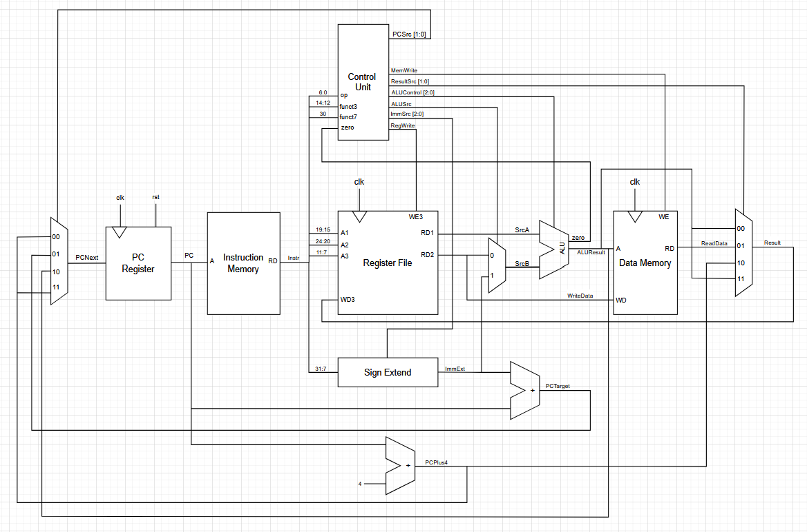

# Single Cycle RISCV Processor
## Overview
Our single cycle implementation covers the basic requirements to run all the initial tests provided. Implemented instructions are listed below:

|Instruction type|Instructions|
|----------------|------------|
|R-type|`add` `sub` `and` `or` `sll` `slt`|
|I-type (Arithmetic|`addi` `slli` `slti`|
|I-type (Load)|`lw` `lbu`|
|I-type (Jump)| `jalr`|
|S-type|`sw` `sb`|
|B-type|`beq` `bne`|
|J-type|`jal`|
|U-type|`lui`|

## Schematic


## Contributions
|Module|Josh|Yichan|Carys|Anthony|
|------|----|------|-----|-------|
|addr||||X|
|ALU||X|*||
|control_unit|||X|*|
|data_memory|*||X||
|instr_mem|||X||
|mux_reg|||X|*|
|pc_reg|||X|*|
|regfile||*|X||
|sign_extend|||X||
|top|*|*|X||
|F1 Assembly||||X|
|System testing and debugging|||X|*|
|PDF testing|||X||
|F1 testing||||X|

`X`: Main contributor

`*`: Partial contributor

## Testing
### Test Cases
Single cycle passes all the tests provided:


### F1 light


[Link to higher quality video](videos/f1.mp4)

### PDF - Gaussian


[Link to higher quality video](videos/gaussian.mp4)

### PDF - Triangle


[Link to higher quality video](videos/triangle.mp4)

### PDF - Noisy


[Link to higher quality video](videos/noisy.mp4)

For the PDF testbench, we display data every 4 cycles in order to plot unique data point per loop. This is because of the implementation of PDF in `5_pdf.s` assembly code:
```
display:    # function send PDF array value to a0 for display
    LI      s1, 0               # s1 = counter to sum pdf values (not in original)
    LI      a1, 0               # a1 = offset into pdf array
    LI      a2, 255             # a2 = max index of pdf array
_loop3:                         # repeat
    LBU     a0, base_pdf(a1)    #   a0 = mem[base_pdf+a1)
    ADD     s1, s1, a0          #   s1 += mem[base_pdf+a1)
    ADDI    a1, a1, 1           #   incr
    BNE     a1, a2, _loop3      # until end of pdf array
    RET
```
We can see that the value in register `a0` only updates once every 4 clock cycles. Plotting every single cycle would lead to the graph look stretched out horizontally.

## F1 Start Lights FSM (Assembly-Level Application)

As an additional application-level demonstration of the processor, an **F1-style start lights finite state machine (FSM)** was implemented entirely in **RISC-V assembly**. This program is designed to run on the single-cycle core and interface with **Vbuddy** for visual output.

### Behaviour Overview
The FSM replicates the behaviour of real Formula 1 start lights:
- Eight red lights illuminate **sequentially and deterministically**
- Once all lights are on, the system waits for a **pseudo-random delay**
- All lights then turn off simultaneously before the sequence restarts


### Random Delay Generation
A **7-bit Linear Feedback Shift Register (LFSR)** is used to generate pseudo-random values. These values are scaled using nested delay loops to produce a visually noticeable random delay in the range of approximately **0.5 to 3 seconds**, ensuring variability while remaining realistic.

The LFSR uses the polynomial:

x<sup>7</sup> + x<sup>6</sup> + 1

and is updated once per full light sequence, avoiding disruption to the deterministic LED count-up phase.

### Timing and Scaling
All timing is implemented using software delay loops, as expected for a single-cycle processor without hardware timers. Delay constants were tuned empirically to achieve:
- Clearly visible light increments
- A noticeable and variable lights-out delay
- Stable behaviour under simulation and Vbuddy output

### Testing and Visualisation
The FSM output is mapped to Vbuddy LEDs, allowing the light sequence and randomised lights-out timing to be observed directly. The testbench runs continuously, enabling repeated observation of different random delays without manual intervention.


