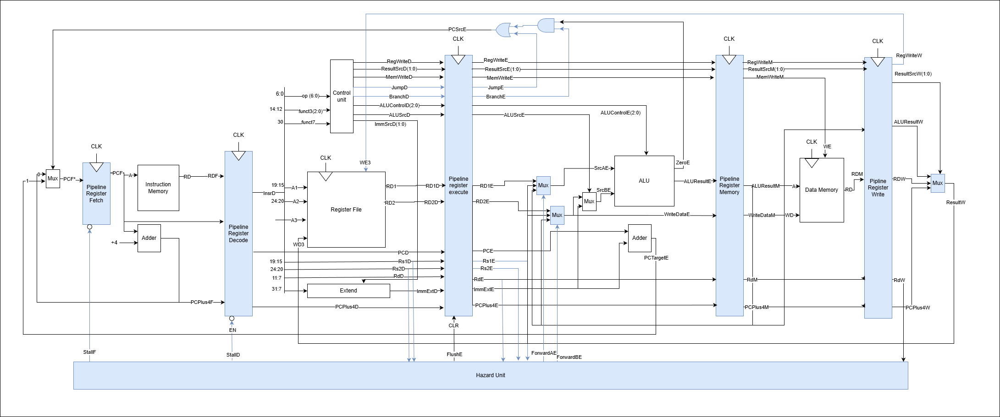

# Personal Statement: RISC-V Processor Implementation

This document explains what I did for the RISC-V RV32I processor project. I’ll go through the design choices I made, the problems I ran into, and what I learned from building a pipelined processor with cache integration. Our team managed to hit all the stretch goals.

## My Contributions

I worked across several major parts of the processor, including the pipeline implementation, cache implementation, the fetch segment of the CPU, top.sv implementation, and testing and validation. Josh and I spent a large portion of our time with the cache implementation and integration with the pipelined CPU.

---
## Lab 4

This project extends from the reduced RISC-V CPU from Lab 4 to a complete RV32I implementation. During lab 4, I was responsible for implementing the Arithmetic Logic Unit (ALU), Register File, and top level integration (`top.sv`) for the single cycle processor. This work formed the foundation for the later pipelining and cache integration.
### ALU and Register File Implementation
#### Implementation

**ALU Design**:

The ALU performs the arithmetic and logical operations required by RISC-V instructions. It takes two operands and a control signal (`ALUControl`) to determine the operation:

- **Arithmetic Operations**: Addition (`ADD`), subtraction (`SUB`) for arithmetic instructions
- **Logical Operations**: Bitwise AND (`AND`), OR (`OR`)
- **Comparison Operations**: Set less than (`SLT`) for comparison instructions

My initial ALU implementation supported the core operations needed for the reduced instruction set. Later, team members added operations to support the full instruction set. I based the control signal encoding on the lecture materials to ensure compatibility with standard instruction decoding.

The ALU generates the following signals:
- `ALUResult_o`, or `out`: The result of the operation
- `Zero_o`, or `eq`: Flag indicating if the result is zero (used for branch instructions)

As noted in my lecture notes, I was able to implement the ALU with a a simple combinational case statement:

```systemverilog
3'b000: out = in0 + in1; //add
3'b001: out = in0 - in1; //subtract
3'b101: eq = in0 < in1; //set less than
3'b011: out = in0 | in1; //bitwise or
3'b010: out = in0 & in1; //bitwise and
```

**Register File Design**:

The register file is a dual port read, single port write memory that stores the RISC-V registers. NB: as per RISC-V instruction, register a0 is hardwired to the `mem[10]`.

**Design Decisions**:

**Asynchronous Reads**: Register file reads need to be combinational so the ALU can get operands in the SAME clock cycle. This is what makes single cycle instruction completion possible.

**Synchronous Writes**: Writes happen on the positive clock edge to ensure proper timing and avoid race conditions, as we learnt in lectures. NB: we are trying to make the processor so that all writes happen on the positive edge of the clock (arbitrary decision).

Demonstration of these design decisions:

```systemverilog
//write on posedge of clock
    always_ff@(posedge clk) begin
        if (we3)
            mem[ad3] <= wd3;
    end

    //read commands
    assign rd1 = mem[ad1];
    assign rd2 = mem[ad2];
    assign a0 = mem[10];
```

**Top Level Integration (`top.sv`)**:

I was also responsible for creating the `top.sv` file where I connected all my teammates' components together. I organised the code following the provided architecture diagram in lab 4, starting from top left to bottom right, which made it easier to reference when working on the file.

While integrating everything, I found a few bugs in my teammates' components related to signal naming, spacing, and logic. I fixed these issues to make sure our design worked correctly. I found changing signal variable names to match that of the diagram rather daunting, which made me realise the importance of communication between teammates and the importance of having only one unique source of truth. After a couple of fixes, the final single cycle reduced instruction set RISC-V processor was able to pass all testcases.

Once I was able to confirm that the reduced RISC-V architecture to be working, I moved all components to our project branch.

#### Commit Evidence

Please see lab 4 commit history (under the same organisation branch).

---

## Pipelined RISC-V Design

To start we made this diagram and took inspiration from the textbook: Digital Design and Computer Architecture (RISC-V Edition) by Sarah Harris and David Harris (as seen in lecture notes). The piepline registers and hazard unit is highlighted in blue.



[See full image here](https://ibb.co/7tk689jL)

### Pipeline Registers

During the pipeline implementation, my individual contribution is as follows:
- Created 3/5 pipeline registers to separate the five stages of the pipelined processor: Prefetch, Fetch, Decode, Execute, Memory, and Writeback
- Implemented enable and clear (flush) functionality to some pipeline registers to support stalling and branch/jump flushing
- Implemented and derived logic for hazard unit
- Wrote pipeline register testbenches, and used them to debug the pipeline registers.

#### Implementation

After our team meeting on November 25th, Josh and I took on the pipeline implementation. Pipeline registers are the synchronisation points between stages, they're what makes pipelining work by allowing instructions to overlap while keeping everything correct. The pipeline diagram above shows the complete processor with pipeline registers separating each stage, which we used as our reference throughout implementation.

NB: while the recommended textbook outlines 4 different pipeline stages, we decided to arbitrarily name an extra pipleine stage called Prefetch, which is the stage before the pc register (essentially the `fetch` stage).

As said previously, I implemented three of the five pipeline registers, which turned out to be trickier than I initially expected:

1. **`pc_reg.sv` (PreFetch/Fetch Register)**: The pc register was modified to accept a stall input. It stores the program counter and outputs the next program counter on the next clock cycle as long as the stall logic (`en_i`) is set to high (`PCNext_i` → `PC_o`). This register was the first to include stall logic (`en_i`), which stalls the outputs for one cycle when there is a lw data dependency (hazard) or a cache miss, delaying the instruction being run by one clock cycle.

   The implementation shows the enable logic:
   ```systemverilog
   always_ff @(posedge clk_i, posedge rst_i) 
       if (rst_i) 
           PC_o <= 0;
       else if (en_i)
           PC_o <= PCNext_i;
       else //freeze
           PC_o <= PC_o; 
   ```
   
   When `en_i = 0`, the program counter stalls so no new instructions are fetched during stalls. Reset has the highest priority to make sure the processor starts from a known state.

2. **`pip_reg_d.sv` (Fetch/Decode Register)**: The pipeline register that connects the fetch and decode stages. It stores:
   - Program counter (`PCF` → `PCD`)
   - Instruction (`InstrF` → `InstrD`)
   - PC+4 value (`PCPlus4F` → `PCPlus4D`)
   This register was the first to include flush logic (`clr_i`), which clears the outputs for one cycle when there is a control hazard, outputting 0 for all outputs. NB: flush (clear) takes precedence, then enable, and then stall:
   ```systemverilog
   always_ff @(posedge clk_i) begin
       if (clr_i) begin
           PCD_o       <= 'b0;
           InstrD_o    <= 'b0;
           PCPlus4D_o  <= 'b0;
       end
       else if (en_i) begin
           PCD_o       <= PCF_i;
           InstrD_o    <= InstrF_i;
           PCPlus4D_o  <= PCPlus4F_i;
       end
       else begin//freeze
           PCD_o       <= PCD_o;
           InstrD_o    <= InstrD_o;
           PCPlus4D_o  <= PCPlus4D_o;
       end
   end
   ```

3. **`pip_reg_w.sv` (Memory/Writeback Register)**: Final pipeline register that I implemented, carrying the following data to `writeback` stage:
   - ALU result and read data from memory
   - Control signals: `RegWrite`, `ResultSrc`
   - Register destination: `RdM` → `RdW`
   - PC+4 value for jump instructions

   Since this register doesn't need flush functionality (at this stage, the instructions are already committed), I designed this register so that it only checks the enable signal:
   ```systemverilog
   always_ff @(posedge clk_i) begin
       if (en_i) begin
           RegWriteW_o     <= RegWriteM_i;
           ResultSrcW_o   <= ResultSrcM_i;
           ALUResultW_o   <= ALUResultM_i;
           ReadDataW_o    <= ReadDataM_i;
           RdW_o          <= RdM_i;
           PCPlus4W_o     <= PCPlus4M_i;
       end
   end
   ```

#### Design Decisions

**Enable Signal (`en_i`)**: Each pipeline register uses an enable signal to control when data is stalled. When `en_i = 0`, the register holds its current value (stall behaviour), which is essential for stalling the pipeline during data hazards or cache misses.

**Clear Signal (`clr_i`)**: The clear signal implements flush functionality. When `clr_i = 1`, all outputs are set to zero, which basically means inserting a `NOP` into the pipeline. This is used when:
- A branch/jump is taken (control hazard) (flush decode stage)
- A lw data dependency (hazard) is detected (flush execute stage)
NB: the pipeline registers I implemented did not require any clear signals (later added for cache)

NB: When neither enable nor clear is active, the register maintains its current state. Moreover, I made stall logic explicit in pipeline registers, which helped when debugging stalls.

**Why Only Some Registers Have Flush**: Only `pip_reg_d` and `pip_reg_e` (Josh made `pip_reg_e`) have flush inputs, not `pip_reg_m` or `pip_reg_w`. This is because we only need to flush when instructions become invalid (when a branch is taken/lw hazard). By the time an instruction reaches the memory stage, it's already committed, so we don't need to flush it. Therefore, flushing decode and execute is enough to handle all the hazards we need to deal with.

The `pip_reg_e` register outlines an example of flush logic, clearing all output signals:
```systemverilog
if (clr_i) begin //flush logic
    RegWriteE_o     <= 'b0;
    ResultSrcE_o    <= 'b0;
    MemWriteE_o     <= 'b0;
    JumpE_o         <= 'b0;
    BranchE_o       <= 'b0;
    ALUControlE_o   <= 'b0;
    ALUSrcE_o       <= 'b0;
    funct3E_o       <= 'b0;
    RD1E_o          <= 'b0;
    RD2E_o          <= 'b0;
    // ... all other outputs cleared
end
```

In contrast, `pip_reg_m` and `pip_reg_w` only have enable logic since they don't need flush functionality.

#### Commit Evidence

**Commit `bd070a2`** (Nov 25, 2025): "Added pipe register_d"
- Files modified: `rtl/pip_reg_d.sv`
- This commit establishes the first pipeline register with flush logic, demonstrating the foundation of the pipelining infrastructure.

**Commit `e054ca8`** (Nov 25, 2025): "Added en to pc_reg"
- Files modified: `rtl/pc_reg.sv`
- Added enable functionality to the PC register to support pipeline stalling, showing integration between fetch stage and prefetch stage

**Why PC Register Needs Enable**: The PC register requires enable logic because it's the pipeline entry point. When the pipeline stalls, the PC must not advance to prevent fetching new instructions. This is coordinated with `pip_reg_d` enable via `!StallF`.

**Commit `79d0681`** (Nov 27, 2025): "Modified Fetch/Decode register to make it accept a clear(flush) input"
- Files modified: `rtl/pip_reg_d.sv`
- This commit adds the flush (`clr_i`) input to the decode pipeline register, enabling branch/jump flushing functionality.

---

### Hazard Unit

[System Verilog](../rtl/hazard_unit.sv) | [Testbench](../tb/tests/component_tests/hazard_unit_tb.cpp)

Regarding the hazard unit implementation, Josh and I implemented data forwarding to resolve RAW (read after write) hazards. Moreover, we also implemented handling for lw stalls when a load instruction is followed by an instruction that uses the previously loaded value. As a result, I made hazard unit to generate flush signals for branch/jump instructions.

#### Implementation

I co-designed and implemented the hazard unit with Josh during a video call on November 28th. The hazard unit is basically the 'manager' of the pipeline registers, keeping the pipeline registers 'correct'. The purpose of a hazard unit is to detect data dependencies and decide whether to forward data/stall the pipeline/flush the pipeline.

We used the Digital Design and Computer Architecture textbook as a guide to the top level units and base naming conventions for this stage. During our video call, we sketched out the hazard unit logic on paper, planning how we were going to deal with all the stalls and flushing logic:


**Data Forwarding Logic**:

The hazard unit generates forwarding signals (`ForwardAE`, `ForwardBE`) to route data from later pipeline stages back to the execute stage when needed. We programmed the hazard unit so that when the register we are trying to access is the register we are trying to write to (with the exception of the x0 register), we would generate a forwarding signal that would forward the signal from memoy/writeback stage to prevent any race conditions.:

```systemverilog
if (((Rs1E_i == RdM_i) && RegWriteM_i) && (Rs1E_i != '0)) begin
    ForwardAE_o = 2'b10;  // Forward from Memory Stage
end
else if (((Rs1E_i == RdW_i) && RegWriteW_i) && (Rs1E_i != '0)) begin
    ForwardAE_o = 2'b01;  // Forward from Writeback Stage
end
```

The same logic applies for `ForwardBE_o` to handle the second ALU operand.

The way we use forward logic is dependant on signals `ForwardAE` and `ForwardBE` outputted from the hazard unit. We can control the input to the ALU with MUXs to give us signals from later stages `ALUResultM` or `ResultW`. The diagram below illustrates how the forwarding multiplexers select between the register file output (`RD1E`/`RD2E`), the writeback result (`ResultW`), or the memory stage ALU result (`ALUResultM`) based on the forwarding control signals:


The check `Rs1E_i != '0` (and `Rs2E_i != '0`) ensures we don't forward when the register is x0 (hardwired to zero).

**Check for x0**: Register x0 is hardwired to zero in RISC-V, it always reads as zero no matter what. If we forwarded from x0, we'd be propagating non-zero values which would be wrong. The check makes sure we don't do that and also saves us from doing unnecessary forwarding logic.

**lw Stall Detection**:

When a load instruction (`ResultSrcE0_i = 1`) is in the execute stage and the following instruction in decode needs that value, we must stall to allow the load instruction to be fully processed before any other instructions take place:

```systemverilog
lwStall = ResultSrcE0_i && ((Rs1D_i == RdE_i) || (Rs2D_i == RdE_i));
```

Note that `ResultSRC0` is the LSB of `ResultSRC` which controls whether we are reading or writing to the register file. We need this to detect load and write instructions. The diagram below shows how the lw hazard is detected and how it is therefore used to trigger stalling of the fetch and decode stages:


The lw stall stalls the fetch and decode stages for one cycle, allowing the load to complete before the dependent instruction proceeds.

**Why Only ResultSrcE0_i**: The least significant bit of `ResultSrcE` is used as the LSB being 1 uniquely identifies to an instruction being a load instructions (`2'b01`). Therefore, the hazard unit would only need to check this one bit.

**Why we stall Prefetch, fetch and decode stages, and not the execute stage**: As by the time we detect the lw stall, The load instruction is already in the execute stage, so we have no choice of stopping the instruction stage. As the instruction that needs the loaded value is in the decode stage, we need to stop it from advancing. We also stall fetch and prefetch to prevent a new instruction from entering decode. NB: we flush the execute stage to insert a NOP command, which creates a one cycle long stall.

**Cache Stalling Integration**:

We also had to integrate cache miss stalling into the hazard unit. When the cache has a miss (`CacheStall_i`), the hazard unit needs to stall all pipeline stages:

```systemverilog
// Stall logic combines lw and cache stalls
StallF_o = lwStall || CacheStall_i;
StallD_o = lwStall || CacheStall_i;
StallE_o = CacheStall_i;  // Cache stall only for later stages
StallM_o = CacheStall_i;
StallW_o = CacheStall_i;
```

Moreover, the flush logic is disabled during cache stalls to prevent interference:

```systemverilog
if (!CacheStall_i) begin // don't flush on cache stall
    FlushD_o = PCSrcE_i;
    FlushE_o = (lwStall || PCSrcE_i);
end
```

**Why Disable Flush During Cache Stalls**: This was an important design decision. The instructions in the pipeline are still valid during a cache miss, they're just waiting for data. If we flushed them, we'd be throwing away valid instructions. Cache stalls should therefore freeze the pipeline and not clear them.

#### Commit Evidence

**Commit `9c41cf6`** (Nov 27, 2025): "Added hazard_unit.sv with researched inputs and outputs"
- Files modified: `rtl/hazard_unit.sv`
- Initial implementation of hazard unit with forwarding and stall logic, establishing the core hazard detection mechanism.

**Commit `4904dff`** (Nov 27, 2025): "Updated hazard_unit.sv file to take in ResultSrcE0 input (0th bit only)"
- Files modified: `rtl/hazard_unit.sv`
- Modified to use only the LSB of `ResultSrcE` to detect load instructions, refining the lw stall detection logic.

**Commit `ec11d62`** (Nov 27, 2025): "Connected hazard unit with components in top.sv file"
- Files modified: `rtl/top.sv`
- Integration of hazard unit into the top level module, connecting all stall and flush signals to pipeline registers.

---

### Top Level Integration

[System Verilog](../rtl/top.sv)

Regarding the top.sv file implementation, I integrated all pipeline stages and registers into a pipelined processor top.sv file (took a lot of time as I had to go between diagrams and component sv files). As a result, I connected hazard unit signals to appropriate pipeline registers, implemented proper variable naming conventions across all module, and connected all datapath components to create a functional processor.

#### Implementation

I led the integration of pipeline registers into `top.sv`, ensuring all stages were properly connected with correct enable and flush signals. Again, similar to the single cycle processor design, I went from top left to bottom right in the diagram. This involved:

1. **Variable Naming Standardization**: Refactored ALL variable names to follow consistent naming conventions with stage suffixes (`_F`, `_D`, `_E`, `_M`, `_W`) as per the pipeline diagram. This was for maintaining code readability and preventing connection errors.

2. **Pipeline Register Connections**: Connected each pipeline register with:
   - Enable signals from hazard unit (`!StallD`, `!StallE`, `!StallM`, `!StallW`)
   - Flush signals from hazard unit (`FlushD`, `FlushE`)
   - All necessary data and control signals between stages

   Example connection for `pip_reg_d`:
   ```systemverilog
   pip_reg_d pip_reg_d (
       .clk_i(clk),
       .en_i(!StallD),
       .clr_i(FlushD),
       .PCF_i(PCF),
       .InstrF_i(InstrF),
       .PCPlus4F_i(PCPlus4F),
       .PCD_o(PCD),
       .InstrD_o(InstrD),
       .PCPlus4D_o(PCPlus4D)
   );
   ```

**Why Inverted Enable Signals**: The enable signals are inverted (`!StallD` instead of `StallD`) because enable signals are usually active-high and inverting `Stall` logic creates that active high enable. When `StallD = 1` (stall needed), `en_i = 0` (disable register), and when `StallD = 0` (no stall), `en_i = 1` (enable register). This is in line with the content from the recommended textbook.

3. **Cache Integration**: Connected the cache module to the memory stage, routing:
   - `CacheStall` from cache back to hazard unit
   - Connected signals between cache and data memory

#### Commit Evidence

**Commit `662a1bd`** (Nov 25, 2025): "Updated top.sv file for 2/4 pipeline registers"
- Files modified: `rtl/top.sv`
- Initial integration of pipeline registers into the top level module, establishing the pipelined architecture.

**Commit `d366818`** (Nov 26, 2025): "Changed variable naming for register address values"
- Files modified: Multiple files in `rtl/`
- Standardized register address variable naming across all modules for consistency.

**Commit `2c511d8`** (Nov 26, 2025): "Changed variable naming for pc to PC for all .sv files as per diagram"
- Files modified: Multiple files in `rtl/`
- Refactored PC variable naming to match the pipeline diagram conventions.

---

## Cache Integration

The cache integrates with the pipelined processor at the memory stage, replacing direct memory access with cache lookups. The diagram below shows how the cache module sits between the execute/memory pipeline register and the data memory, handling cache hits and misses while coordinating with the hazard unit to stall the pipeline during cache operations:

.drawio.png>)

### Cache Foundation

[System Verilog](../rtl/cache.sv)

Regarding the cache implementaion, Josh and I designed the initial cache module structure, established the interface between cache and memory stage, and designed the state machine for cache operations. 

#### Implementation

On December 3rd, I worked with Josh on the cache foundation during a video call. We both contributed to the cache implementation:

We started by sketching out our initial ideas during video calls, iterating on the cache structure and state machine design. These early sketches show our thought process as we worked through the cache organization and how it would interface with the memory stage:


We iterated our initial design quite a few times and came up with this finalised diagram for our cache memory, which shows the complete cache structure including the 2 way set associative organization, tag comparison logic, and data paths:


1. **Initial Module Structure**: Josh and I worked together on defining the cache module interface, including:
   - Input/output ports for memory operations
   - Cache miss and stall signal definitions
   - Cache organisation: 2 way set associative with LRU replacement (as in lecture notes)
   - Cache line format: `[LRU(1) | Valid1(1) | Dirty1(1) | Tag1(22) | Data1(32) | Valid2(1) | Dirty2(1) | Tag2(22) | Data2(32)]`
   - We set the tag to 22 bits so we had 8 bits for sets (2^8 = 256 sets = 512 ways), giving us 2KB (512 x  4 bytes per way = 2KB) total data cache capacity
   - A lot of the code was extracting values from inputs and manipulating them to fit the cache memory format, and vice versa. This was rather a tedious task.

2. **State Machine Design**: Discussed and refined the cache state machine states:
   - `IDLE`: Normal cache operation
   - `WRITEBACK`: Writing dirty data back to memory
   - `FETCH`: Fetching data from memory on miss
   - `UPDATE`: Updating cache with fetched data

   This is the structure we decided on implementing for the cache miss. The state machine diagram below shows the transitions: IDLE → WRITEBACK (if dirty) → FETCH → UPDATE → IDLE, or IDLE → FETCH (if clean) → UPDATE → IDLE. Each state corresponds to a distinct stall condition:

   

   The state machine and hit/miss detection logic:
   ```systemverilog
   typedef enum {IDLE, WRITEBACK, FETCH, UPDATE} my_state;
   my_state current_state, next_state;
   
   // Hit or miss detection
   logic tag_0_hit, tag_1_hit, cache_hit, cache_miss;
   assign tag_0_hit = (tag_addr == cache_tag_0) && cache_valid_0;
   assign tag_1_hit = (tag_addr == cache_tag_1) && cache_valid_1;
   assign cache_hit = (tag_0_hit || tag_1_hit) && cache_en;
   assign cache_miss = cache_en && !cache_hit;
   ```
   
   The cache checks both ways (2 way set associative) and determines hits by comparing tags and checking valid bits. When a miss occurs, the state machine transitions through WRITEBACK (if dirty), FETCH (from main memory), and UPDATE (store in cache) states.

#### Commit Evidence

**Commit `1c38141`** (Dec 3, 2025): "Started foundation draft for cache.sv Coauthored with Josh and done on live call session"
- Files modified: `rtl/cache.sv`
- Initial cache module structure, demonstrating collaborative design work with Josh

**Commit `f99109a`** (Dec 3, 2025): "update logic in cache.sv and deal with cache hits and outputs as well as bug fixes, Coauthored with Yichan over live video call"
- Files modified: `rtl/cache.sv`
- State Machine design structure implemented, 
---

### Cache Stalling Mechanism

Regarding the cache stalling mechanism, I modified pipeline registers to support cache stalling, integrated cache stall signals with hazard units, and ensured proper pipeline stalling during cache misses.

#### Implementation

On December 6th, I coauthored changes to all pipeline registers with Josh over a live video call to support cache availability stalls. The key modifications were:

1. **Pipeline Register Enable Logic**: Modified all pipeline registers to accept stall signals from the hazard unit:

2. **Hazard Unit Integration**: Updated hazard unit to handle cache stalls separately from lw stalls. Cache stalls will have to stall all stages to prevent new instructions from entering and to buy enough clock cycles to retrieve information from data memory. The flush logic is disabled during cache stalls to prevent interference.

**Why Stall All Stages on Cache Miss**: Cache misses take multiple cycles (usually 3 to 4 cycles going through WRITEBACK → FETCH → UPDATE states). If we stall all stages, no instruction can advance with stale data and we maintain memory consistency. The alternative would be to only stall memory/writeback stages, but that would require complex buffering and state machines to track partially executed instructions. Stalling everything is simpler and makes sure we don't have any subtle bugs. We prioritised correctness over performance here.

**Pipeline Register Modifications for Cache**: Josh and I went back and added enable signals to all the pipeline registers to support cache stalling. Registers without flush (`pip_reg_m`, `pip_reg_w`) just needed enable logic. Registers with flush (`pip_reg_d`, `pip_reg_e`) needed both enable and flush to work together properly. We also had to deal with funct3 propagation for cache byte operations.

**Funct3 handling**

One of the problems we faced during our cache implementaiton was how we dealt with the signal `funct3`. After debugging our cache implementation with testbenches and assembly programs, it turned out that we needed to propagate funct3 through pipeline registers to support byte/half/word operations in the memory stage. This required extracting `funct3` from instruction in decode stage, passing through `pip_reg_e` and `pip_reg_m` eventually to memory stage, and routing to cache module for proper byte offset handling.

An important detail was ensuring `funct3` is passed through the cache to memory for operations that miss. During cache fill operations, we always access memory as words (32 bits), but for direct cache access, we pass through the original `funct3` to enable byte operations. The diagrams below illustrate how `funct3` flows through the processor logic and to the data module through the cache module:


---

## Testing and Verification

[Testbenches](../tb/tests/component_tests/)

I developed testbenches for all pipeline registers using the GTest framework and later updated them with Josh for cache stall handling. Each register was tested for normal operation, flushing, stalling, and correct signal propagation, including `funct3`. Additional testbenches covered the 3 way multiplexer, PC register, sign extension module, and the register file. For the register file, tests verified dual port reads, correct write behavior, x0 always reading zero, same cycle read/write handling, and multi register operations. These tests caught critical bugs early, such as improper writes to x0 and timing issues, and ensured reliable system integration. The test driven approach greatly reduced debugging time and confirmed the final pipelined processor with cache operated correctly.

#### Commit Evidence

**Commit `b6cff35`** (Dec 8, 2025): "Added testbenches for all pipeline registers"
- Files modified: `tb/tests/component_tests/pip_reg_d_tb.cpp`, `pip_reg_e_tb.cpp`, `pip_reg_m_tb.cpp`, `pip_reg_w_tb.cpp`

**Commit `a45c992`** (Dec 8, 2025): "Added mux3 testsbench.cpp - copied format from other tb.cpp files"
- Files modified: `tb/tests/component_tests/mux3_tb.cpp`
- Testbench for the 3 way multiplexer, ensuring proper writeback stage data selection.

**Commit `264cf93`** (Dec 8, 2025): "Added regfile and sign_extend testbenches (copied from lab 4) with updated naming conventions"
- Files modified: `tb/tests/component_tests/regfile_tb.cpp`, `sign_extend_tb.cpp`
- Updated existing testbenches to match new variable naming conventions.

---

## Reflection and Learnings

### Technical Learnings

Building this processor made me realize how complicated computer architecture really is. I learned a lot by going from the theory in class to actually making it work.

1. **Pipeline Synchronisation**: I learnt how pipeline registers work as synchronisation points between stages.

2. **Hazard Resolution**: Working on the hazard unit taught me about different types of data hazards (RAW, WAR, WAW) and how implementing different signals can resolve most of them without stalling. The lw hazard was interesting because you can't use a forwarding signal. Instead, you had to stall because the data isn't available until after the memory stage.

3. **Cache Integration**: Integrating the cache with the pipeline was challenging. We had to coordinate cache miss stalling with the existing hazard detection, in addition to func3 propagation through our cache unit.

4. **SystemVerilog Best Practices**: I learnt how important consistent naming conventions are. Modular design made everything much easier to debug.

### Challenges and Solutions

1. **Cache Stall and Hazard Coordination**: Integrating cache stalling with existing hazard detection revealed a fundamental design challenge: both mechanisms control pipeline flow, but with different semantics. Resolving these two conflicts to avoid race conditions required deep understanding of both mechanisms' requirements.

2. **Funct3 Propagation**: The `funct3` field wasn't initially passed through the pipeline, which caused byte operations to fail. After debugging, we realised the cache needed `funct3` for byte offset calculations, so we added it to the execute and memory pipeline registers.

3. **Variable Naming**: Early on, inconsistent naming (`rs1` vs `Rs1` vs `RS1`) made integration really difficult. I spent a lot of time refactoring to establish consistent naming conventions. This really paid off during integration and debugging.

### Mistakes and Improvements

1. **Incomplete Initial Design**: When we first created the pipeline registers, we didn't think about all the signals that would need to pass through. For example, `funct3` was added later when we discovered it was needed for cache operations. In the future, I'd spend more time upfront analysing all required signals.

2. **Testing After Integration**: I created testbenches relatively late in the process. Looking back, I probably should have started unit testing earlier as it would have saved a lot of debugging headaches. Moving forward, I'll adopt a test driven development approach.

3. **Communication**: There were times when I made assumptions about what other team members were implementing, which led to integration conflicts. I probably could have communicated more effectively, which would have prevented a few integration conflicts.

### What I Would Do Differently

1. **Earlier Testing**: I would create testbenches for each module immediately after implementation, rather than waiting until integration. This would catch bugs earlier and make debugging easier.

2. **More Detailed Planning**: Before implementing pipeline registers, I would create a detailed signal list for each stage, making sure all necessary signals are included from the start.

3. **Better Documentation**: I would document design decisions and assumptions as I go, making it easier for teammates to understand my implementation and for future reference.

### Deepest Understanding

The thing that deepened my understanding the most was seeing how **pipeline stages work together as a system**. At first, I thought of each stage in isolation, but through implementing the hazard unit and integrating cache stalling, I learnt how stages have to coordinate to maintain correctness. The balance between forwarding and stalling was interesting.

This experience made me more aware of system level considerations in hardware design.

### Conclusion

This project was a great learning experience that combined theory with practical implementation. Working closely with teammates on integration and debugging taught me the importance of clear communication and systematic problem solving. The challenges we faced and overcame, particularly in cache integration and hazard resolution, really strengthened my understanding of processor architecture and SystemVerilog design.

I'm proud that our team achieved all the stretch goals. The skills I've developed in hardware design, debugging, and teamwork will be really valuable for my future work.